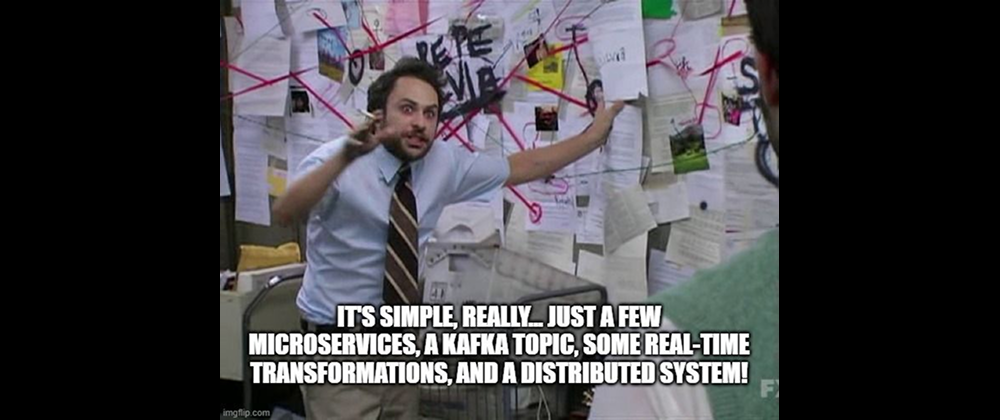

# sbus-integration-test
An integration test of the Kafka Connect connector for Azure Service Bus and the Service Bus Router.



To run through the test, firstly login to Azure with:

```shell
az login
```

Then export the relevant subscription ID so that Terraform can use the variable:

```shell
export TF_VAR_subscription_id='00000000-0000-0000-0000-000000000000'
```

Ensure that you are configured to connect to Kubernetes:

```shell
kubectl get nodes
```

Which should return something similar to:

```
NAME                 STATUS   ROLES    AGE   VERSION
green-pool-0-6ygsj   Ready    <none>   11d   v1.32.2
green-pool-0-6ygso   Ready    <none>   11d   v1.32.2
green-pool-0-6ygsx   Ready    <none>   11d   v1.32.2
```

Deploy Strimzi/Kafka with:

```shell
make
terraform -chdir=terraform/kafka apply -auto-approve -input=false
```

Capture the credentials for Strimzi Kafka:

```shell
mkdir -p certs
kubectl -n strimzi get secret sbox-cluster-ca-cert -o jsonpath='{.data.ca\.crt}' | base64 -d > certs/ca.crt
export KAFKA_BOOTSTRAP=$(kubectl -n strimzi get kafka sbox -o=jsonpath='{.status.listeners[?(@.name=="external")].bootstrapServers}')
export TF_VAR_kafka_bootstrap="$KAFKA_BOOTSTRAP"
export KAFKA_PASSWORD=$(kubectl -n strimzi get secret/sbox -o json | jq -r .data.password | base64 -d)
export TF_VAR_kafka_password="$KAFKA_PASSWORD"
```

Prepare credentials for Kafka Connect:

```shell
keytool -importcert \
  -keystore certs/kafka-truststore.jks \
  -storepass changeit \
  -alias kafka-ca \
  -file certs/ca.crt \
  -noprompt

cat > certs/kafka-client-jaas.conf << _EOF
KafkaClient {
  org.apache.kafka.common.security.scram.ScramLoginModule required
  username="sbox"
  password="${KAFKA_PASSWORD}";
};
_EOF
```

New pre-load the data into Kafka:

```shell
./data_gen.py
```

Deploy the Azure infrastructure:

```shell
terraform -chdir=terraform/azure apply -auto-approve -input=false
```

Capture various environment variables for credentials:

```shell
export SBNS_CONNECTION_STRING=$( terraform -chdir=terraform/azure output -raw sbns_connection_string )
export ST_CONNECTION_STRING=$( terraform -chdir=terraform/azure output -raw st_connection_string )
```

Finally, to start the archivist and router, run:

```shell
docker compose up -d archivist router
```

Use the following KCL query in Log Analytics to track how many records are being transferred:

```
ContainerInstanceLog_CL
| where Message has "Received"
| extend RecordCount = extract(@"Received\s+(\d+)\s+records", 1, Message)
| where isnotempty(RecordCount)
| extend RecordCountInt = toint(RecordCount)
| where RecordCountInt >= 0 and RecordCountInt <= 500
| project TimeGenerated, Message, RecordCountInt
| order by TimeGenerated desc
```

When finished, run the following to nuke everything from orbit:

```shell
make clean
```

## Results

| Version                                                           | Record Count | Duration  | TPS  |
| ----------------------------------------------------------------- | ------------ | --------- | ---- |
| [0.1.0](https://github.com/cbdq-io/sbus-integration-test/pull/2)  | 128,000      | PT47M37S  | 44.8 |
| [0.2.0](https://github.com/cbdq-io/sbus-integration-test/pull/8)  | 128,000      | PT47M9S   | 45.3 |
| [0.3.0](https://github.com/cbdq-io/sbus-integration-test/pull/10) | 128,000      | PT51M48S  | 41.2 |
| [0.4.0](https://github.com/cbdq-io/sbus-integration-test/pull/12) | 128,000      | PT46M12S  | 46.2 |
